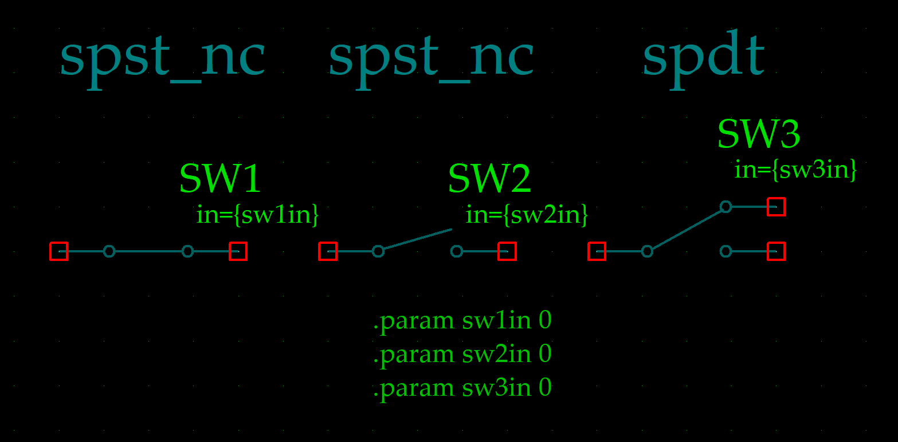

# Switches for LTspice

Simple parameter-controllable switches for LTspice, written to reduce
confusion caused by schematic symbols not looking like they do on the
original schematic being simulated.

# Usage

Copy the `.lib` and `.asy` files to a place where LTspice can
find them - library path, the user files directory or the same
directory where your schematic is.

I found it somewhat confusing to express switch positions in English,
which is not my native language. I went for using ´in´ to reflect the
situation where the switch is manipulated from the default position.

The parameter `in` controls the switch state. When it is set to a
value less than 0.5, the switch is in the default position. When
larger than 0.5, the switch is considered "pushed in". Multiple poles
can be simulated by creating multiple switches using the same
parameter for control.

# Build

M4 macro processor is required to rebuild the symbols.

To build, just run `make`.